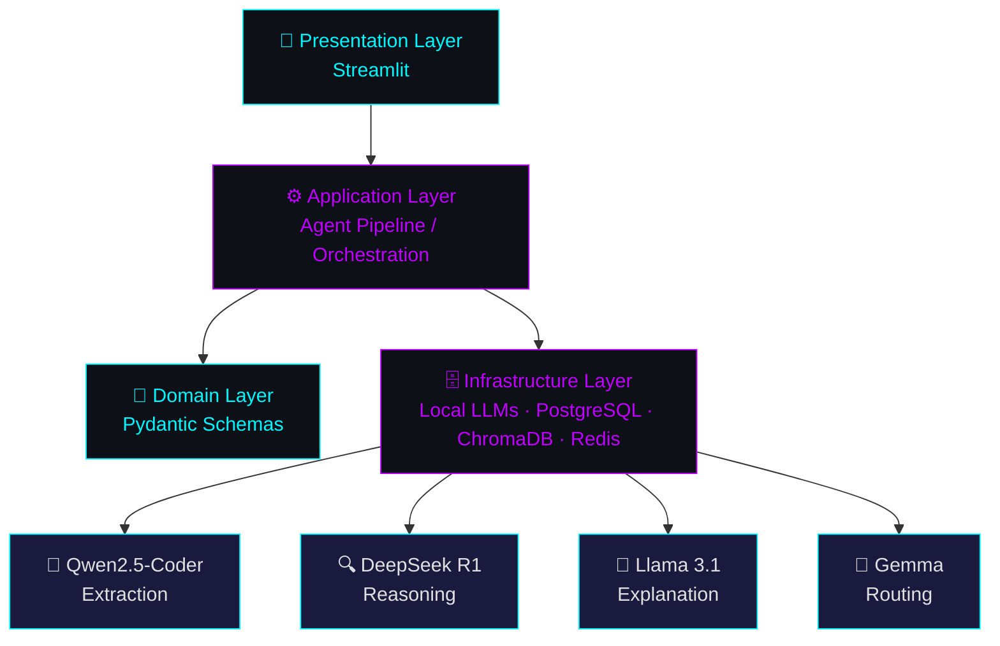

<div align="center">

# 👋 Hi, I'm Sayyam Shahbaz

<a href="https://github.com/obligator11">
  
</a>

<br/>

[](https://www.linkedin.com/in/sayyam-shahbaz-05894a194)
[](https://www.instagram.com/obligator11/)
[](https://github.com/obligator11/Vision-Core-Projects)

</div>

<br/>

## ⚡ About Me

```yaml
engineer:
  name: "Sayyam Shahbaz"
  location: "Pakistan"
  certifications: ["Microsoft Certified AI Engineer", "IBM Certified AI Engineer"]
  specialization: ["Software Architecture", "System Design", "Agentic AI Engineering"]
  currently_building: "Multi-Agent Digital Ops Team — IT Helpdesk MVP"
  philosophy: "Local-first, zero-paid-API, human-in-the-loop by design"
  learning: ["Agentic architectures", "MCP integrations", "Applied spatial math for CV"]
  brand: "@SayyamAILab — content on TikTok / Instagram / LinkedIn / YouTube"
```

I design and ship **multi-agent AI systems that run entirely on local infrastructure** — orchestrating models like Qwen2.5-Coder, DeepSeek-R1, Llama 3.1, and Gemma through Ollama and LM Studio, with PostgreSQL, ChromaDB, and Redis handling state, memory, and concurrency. Every system I build follows the same four-layer discipline: **Presentation → Application → Domain → Infrastructure.**

Before this, I spent months building real-time computer vision and AR systems (pose estimation, gesture control, YOLO-based tracking) — that CV depth now shows up in how I think about latency, threading, and perception pipelines inside agent systems.

<br/>

## 🧠 Currently Architecting

<table>
<tr>
<td width="33%" valign="top">

**🎫 Multi-Agent Digital Ops Team**
IT Helpdesk MVP · v3 architecture
Redis/RQ concurrency, Prometheus + Grafana observability, 18-step incremental build

</td>
<td width="33%" valign="top">

**🧾 Invoice/AP Automation Agent**
4-model pipeline: extraction → anomaly reasoning → explanation → routing, with a human-in-the-loop approval gate

</td>
<td width="33%" valign="top">

**💻 CloudCLI**
Local agentic coding studio — redirects Claude Code–style workflows through a self-hosted Gemma 4 (31B) model via Ollama, React/Node.js UI

</td>
</tr>
</table>

<br/>

## 🏗️ How I Build — Four-Layer Architecture

Every agentic system I ship follows this pattern:



<br/>

## 📦 Featured Projects

### 🤖 Agentic AI & Automation

<details>
<summary><b>🧾 Invoice / AP Automation Agent</b> — local-first multi-agent finance pipeline</summary>
<br/>

A multi-agent pipeline for invoice processing and accounts-payable automation, entirely local:

- **Qwen2.5-Coder** — structured data extraction from invoices
- **DeepSeek R1** — anomaly detection & reasoning
- **Llama 3.1** — plain-language explanation of flagged issues
- **Gemma** — routing logic
- **PostgreSQL + ChromaDB** — structured + semantic storage
- **Human-in-the-loop gate** — nothing auto-approves without review

`Python` `PostgreSQL` `ChromaDB` `Ollama` `LM Studio` `Pydantic`

🔗 [github.com/obligator11/invoice-ap-agent](https://github.com/obligator11/invoice-ap-agent)

</details>

<details>
<summary><b>🎫 Multi-Agent Digital Ops Team</b> — IT Helpdesk MVP</summary>
<br/>

A v3 agentic architecture built for concurrent, observable multi-agent operations:

- **Redis/RQ** for task concurrency across agents
- **Prometheus + Grafana** (Dockerized) for full observability
- Built via an 18-step incremental build process, IT Helpdesk locked in as the first use case
- Follows the same four-layer discipline as all other systems

`Python` `Redis` `Docker` `Prometheus` `Grafana` `Streamlit`

</details>

<details>
<summary><b>💻 CloudCLI</b> — self-hosted agentic coding studio</summary>
<br/>

A local agentic coding environment that redirects Claude Code–style inference through a self-hosted **Gemma 4 (31B)** model via Ollama, with a React/Node.js web UI on top.

- Custom Modelfile with extended context window
- PowerShell launcher scripts with environment configuration
- MCP layer + Node.js backend + React (Vite) frontend + one-click bootstrap launcher
- Actively tuning VRAM/KV-cache usage for 31B-scale local inference

`Ollama` `Node.js` `React` `Vite` `MCP`

</details>

<details>
<summary><b>🧠 Local Dual-LLM RAG Workspace</b> — NotebookLM-style local research tool</summary>
<br/>

A Streamlit RAG application combining **DeepSeek-R1** (reasoning) and **Qwen2.5-Coder** (implementation) via LM Studio, with isolated per-notebook vector vaults in ChromaDB and sliding-window chunking.

`Python` `Streamlit` `ChromaDB` `LM Studio`

🔗 [github.com/obligator11/AI_Duo_LLM](https://github.com/obligator11/AI_Duo_LLM)

</details>

### 👁️ Computer Vision & AR Suite

<details>
<summary><b>🎮 Vision-Core-Projects</b> — 60+ real-time CV/AR experiments</summary>
<br/>

A suite of single-file, zero-external-asset CV/AR experiments: pose-driven games (MediaPipe Pose), gesture-controlled tools, AR overlays, and full-body tracking games — each with procedural audio and threaded capture pipelines.

`OpenCV` `MediaPipe` `YOLO11` `Pygame`

🔗 [github.com/obligator11/Vision-Core-Projects](https://github.com/obligator11/Vision-Core-Projects)

</details>

<details>
<summary><b>👥 CrowdAI</b> — real-time crowd density & flow analytics</summary>

YOLOv8 + DBSCAN clustering for crowd density and flow analysis.

`YOLOv8` `DBSCAN` `OpenCV`

🔗 [github.com/obligator11/CrowdAI](https://github.com/obligator11/CrowdAI)

</details>

<details>
<summary><b>🚗 DriverFatigueSystem</b> — attention & fatigue monitor</summary>

MediaPipe Face Mesh–based driver fatigue detection using EAR/MAR metrics.

`MediaPipe` `OpenCV`

🔗 [github.com/obligator11/DriverFatigueSystem](https://github.com/obligator11/DriverFatigueSystem)

</details>

<details>
<summary><b>🎤 InterviewAnalyzer</b> — multi-modal interview confidence analyzer</summary>

Combines MediaPipe Face Mesh, Pose, and Whisper for multi-modal interview analysis.

`MediaPipe` `Whisper` `OpenCV`

🔗 [github.com/obligator11/InterviewAnalyzer](https://github.com/obligator11/InterviewAnalyzer)

</details>

### 🏢 Client & Product Work

<details>
<summary><b>🏋️ Solid Gym Management System</b> — PySide6 desktop app</summary>

Modular gym management desktop application with RBAC, financial transaction logging, and webcam/biometric hardware integration. Rewritten from Tkinter to Streamlit with Google Sheets–backed state and automated PDF/email dispatch.

`Python` `Streamlit` `PySide6` `Google Sheets API`

🔗 [github.com/obligator11/gym-management-system](https://github.com/obligator11/gym-management-system)

</details>

<details>
<summary><b>🏛️ Triple Eyes Real Estate & Marketing</b> — architectural firm website</summary>

React/TypeScript site with Tailwind CSS and Framer Motion for an Islamabad-based architectural firm.

`React` `TypeScript` `Tailwind CSS` `Framer Motion`

</details>

<br/>

## 🛠️ Tech Stack by Layer

<table>
<tr><td><b>🎨 Presentation</b></td><td>


</td></tr>
<tr><td><b>⚙️ Application</b></td><td>


</td></tr>
<tr><td><b>🗄️ Infrastructure</b></td><td>


</td></tr>
<tr><td><b>👁️ Computer Vision</b></td><td>


</td></tr>
</table>

<br/>

## 📊 GitHub Stats

<div align="center">


<br/>


</div>

<br/>

## ✍️ Random Dev Quote

<div align="center">


</div>

<br/>

## 🔝 Top Contributed Repo

<div align="center">


</div>

<br/>

## 🌐 Connect

<div align="center">

[](https://www.linkedin.com/in/sayyam-shahbaz-05894a194)
[](https://www.instagram.com/obligator11/)

<sub>⚡ Fun fact: I run a local RTX 4060 Ti rig to train and serve LLMs — no cloud APIs, no monthly bills.</sub>

</div>
