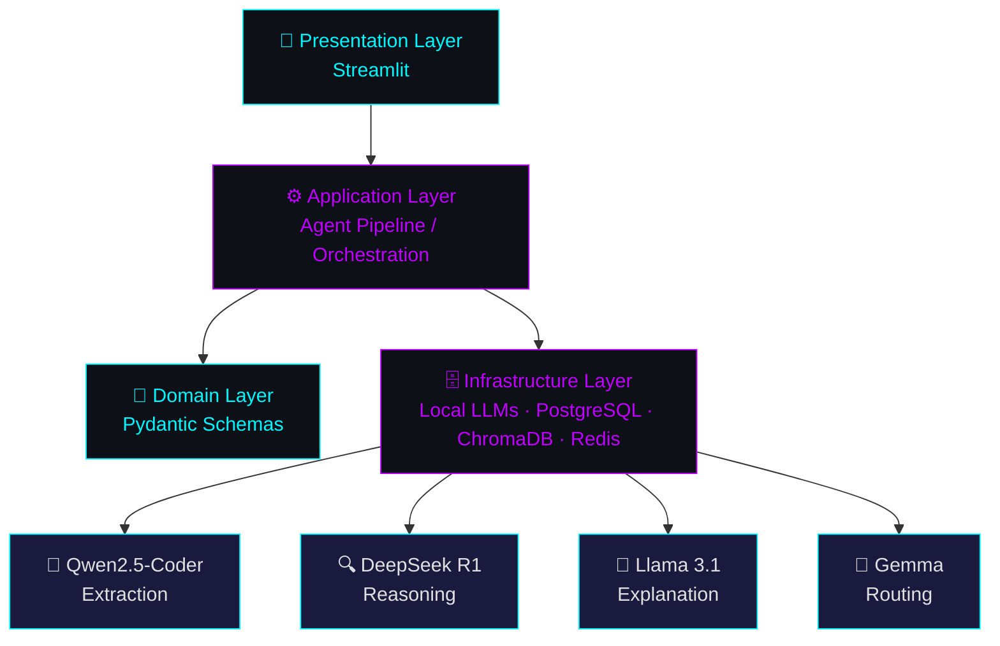

<div align="center">

# 👋 Hi, I'm Sayyam Shahbaz

<a href="https://github.com/obligator11">
  
</a>

<br/>

[](https://www.linkedin.com/in/sayyam-shahbaz-05894a194)
[](https://www.instagram.com/obligator11/)
[](https://github.com/obligator11/Vision-Core-Projects)

</div>

<br/>

## ⚡ About Me

```yaml
engineer:
  name: "Sayyam Shahbaz"
  location: "Pakistan"
  certifications: ["Microsoft Certified AI Engineer", "IBM Certified AI Engineer"]
  specialization: ["Software Architecture", "System Design", "Agentic AI Engineering"]
  currently_building: "Multi-Agent Digital Ops Team — IT Helpdesk MVP"
  philosophy: "Local-first, zero-paid-API, human-in-the-loop by design"
  learning: ["Agentic architectures", "MCP integrations", "Applied spatial math for CV"]
  brand: "@SayyamAILab — content on TikTok / Instagram / LinkedIn / YouTube"
```

I design and ship **multi-agent AI systems that run entirely on local infrastructure** — orchestrating models like Qwen2.5-Coder, DeepSeek-R1, Llama 3.1, and Gemma through Ollama and LM Studio, with PostgreSQL, ChromaDB, and Redis handling state, memory, and concurrency. Every system I build follows the same four-layer discipline: **Presentation → Application → Domain → Infrastructure.**

Before this, I spent months building real-time computer vision and AR systems (pose estimation, gesture control, YOLO-based tracking) — that CV depth now shows up in how I think about latency, threading, and perception pipelines inside agent systems.

<br/>

## 🧠 Currently Architecting

<table>
<tr>
<td width="33%" valign="top">

**🎫 Multi-Agent Digital Ops Team**
IT Helpdesk MVP · v3 architecture
Redis/RQ concurrency, Prometheus + Grafana observability, 18-step incremental build

</td>
<td width="33%" valign="top">

**🧾 Invoice/AP Automation Agent**
4-model pipeline: extraction → anomaly reasoning → explanation → routing, with a human-in-the-loop approval gate

</td>
<td width="33%" valign="top">

**🧠 Local Dual-LLM RAG Workspace**
NotebookLM-style research tool — DeepSeek-R1 (reasoning) + Qwen2.5-Coder (implementation) via LM Studio, isolated per-notebook ChromaDB vaults

</td>
</tr>
</table>

<br/>

## 🏗️ How I Build — Four-Layer Architecture

Every agentic system I ship follows this pattern:



<br/>

## 📌 Top Repositories

### 🤖 Agentic AI & Automation

<div align="center">

[](https://github.com/obligator11/invoice-ap-agent)
[](https://github.com/obligator11/AI_Duo_LLM)

</div>

- **Invoice/AP Automation Agent** — 4-model local pipeline (Qwen2.5-Coder → DeepSeek R1 → Llama 3.1 → Gemma) with PostgreSQL + ChromaDB and a human-in-the-loop approval gate
- **Local Dual-LLM RAG Workspace** — NotebookLM-style research tool combining DeepSeek-R1 + Qwen2.5-Coder via LM Studio, with per-notebook ChromaDB vaults

### 👁️ Computer Vision & AR Suite

<div align="center">

[](https://github.com/obligator11/Vision-Core-Projects)
[](https://github.com/obligator11/CrowdAI)

[](https://github.com/obligator11/DriverFatigueSystem)
[](https://github.com/obligator11/InterviewAnalyzer)

</div>

- **Vision-Core-Projects** — 60+ real-time CV/AR experiments: pose-driven games, gesture control, AR overlays, all single-file with procedural audio
- **CrowdAI** — real-time crowd density & flow analytics using YOLOv8 + DBSCAN clustering
- **DriverFatigueSystem** — MediaPipe Face Mesh–based fatigue/attention monitor using EAR/MAR metrics
- **InterviewAnalyzer** — multi-modal interview confidence analyzer (MediaPipe Face Mesh + Pose + Whisper)

### 🏢 Client & Product Work

<div align="center">

[](https://github.com/obligator11/gym-management-system)

</div>

- **Solid Gym Management System** — modular PySide6 desktop app with RBAC, financial transaction logging, and Google Sheets–backed state
- **Triple Eyes Real Estate & Marketing** — React/TypeScript site with Tailwind CSS and Framer Motion for an Islamabad architectural firm

> 💡 The Multi-Agent Digital Ops Team isn't a public repo yet — once you push it, send me the repo name and I'll add a pin card for it too.

<br/>

## 🛠️ Tech Stack by Layer

<table>
<tr><td><b>🎨 Presentation</b></td><td>


</td></tr>
<tr><td><b>⚙️ Application</b></td><td>


</td></tr>
<tr><td><b>🗄️ Infrastructure</b></td><td>


</td></tr>
<tr><td><b>👁️ Computer Vision</b></td><td>


</td></tr>
</table>

<br/>

## 📊 GitHub Stats

<div align="center">


<br/>


</div>

<br/>

## ✍️ Random Dev Quote

<div align="center">


</div>

<br/>

## 🌐 Connect

<div align="center">

[](https://www.linkedin.com/in/sayyam-shahbaz-05894a194)
[](https://www.instagram.com/obligator11/)

</div>
